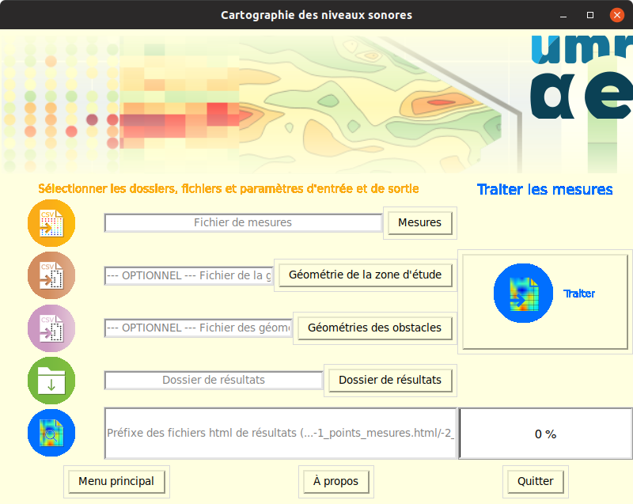

# Valise pédagogique

Cette valise pédagogique s'adresse aux enseignants en Collège ou Lycée en support à une démarche de sensibilisation des élèves à la problématique des nuisances sonores. 

La valise pédagogique se présente sous la forme d'un kit composé :

* d'une **application** pour la cartographie du bruit en espace clos, tel qu'une salle de classe ou un atelier, sur la base de mesures acoustiques réalisées à partir de l'application Android gratuite NoiseCapture (https://noise-planet.org/noisecapture.html);
* d'un ensemble de **documents ressources** introduisant les concepts physiques et perceptifs associés au bruit.

# Application pour la cartographie du bruit

L'application "Cartographie des niveaux sonores" permet de réaliser des cartes de bruit en milieu fermé. 

Fonctionnant dans un environnement Windows ou bien Linux, elle est fournie gratuitement, selon les termes de la licence GPL v3 ([voir](./LICENCE)).

## Documentation utilisateur

Pour télécharger et prendre en main cette application, nous vous invitons à consulter la documentation présente dans le dossier `docs` (ou bien en cliquant [ICI](./docs/Execution_logiciel.md)).

# Documents ressources

 Dans le dossier `ressources/presentation` se trouvent les deux documents suivants :

- `/intro_acoustique/Presentation_generale.pdf` : un cours d'[introduction à l'acoustique](./ressources/presentation/intro_acoustique/Presentation_generale.pdf)
- `/atelier_carto_noisecapture/Mesure_avec_NoiseCapture.pdf` : la [présentation de la méthodologie](./ressources/presentation/atelier_carto_noisecapture/Mesure_avec_NoiseCapture.pdf) proposée pour mesurer l'environnement sonore, à l'aide de l'application NoiseCapture

Ces supports sont fournis au format .pdf et selon les termes de la licence ouverte Creative Commons - [CC-BY-SA 4.0](http://creativecommons.org/licenses/by-sa/4.0/)

# Auteurs

Le logiciel "Cartographie des niveaux sonores" a été développé par Gwenaël Guillaume, Chargé de Recherche en Acoustique au Cerema et au sein de l'Unité Mixte de Recherche en Acoustique Environnementale ([UMRAE](www.umrae.fr)).
Pour toute question relative à cette application, veuillez le contacter à l'adresse suivante : gwenael.guillaume [at] cerema.fr

Une partie de la documentation a été réalisée par Gwendall Petit, Ingénieur d'Etude en Sciences de l'Information Géographique au sein du laboratoire [Lab-STICC](https://labsticc.fr/) (CNRS UMR 6285).

Les auteurs sont tout deux membres du projet [Noise-Planet](https://noise-planet.org/).

# Remerciements
PRSE Grand-Est (http://www.grand-est.prse.fr/)
