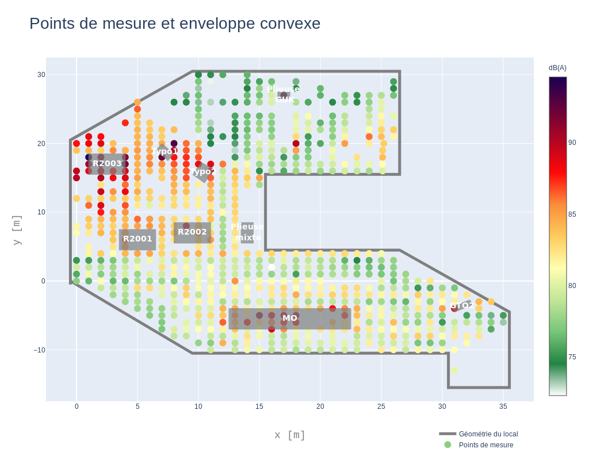
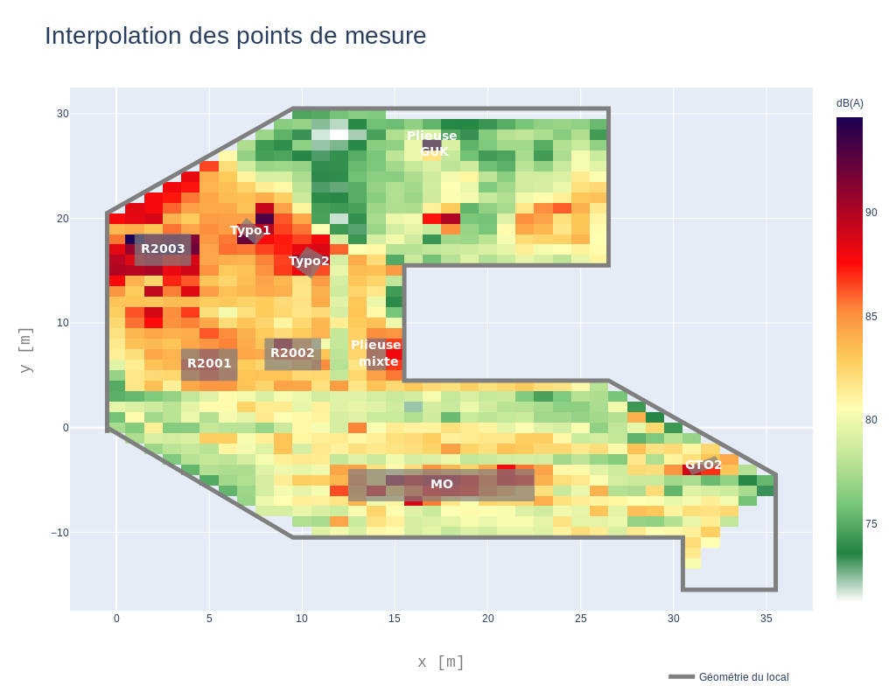
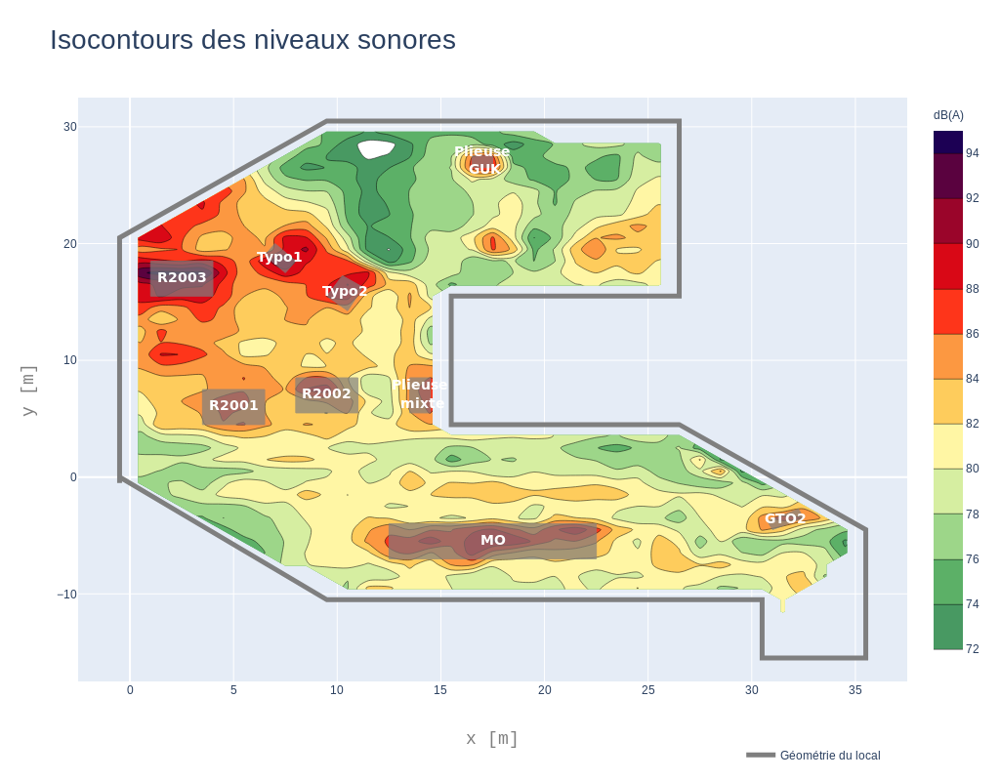
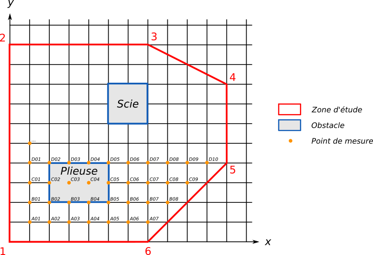

# Manuel d'utilisation du logiciel "Cartographie des niveaux sonores"

Cette documentation peut être téléchargée sous la forme d'un `.pdf` en cliquant [ICI](./Execution_logiciel.pdf)

[TOC]

## Auteur

Le logiciel "Cartographie des niveaux sonores" a été développé par Gwenaël Guillaume, Chargé de Recherche en Acoustique au Cerema et au sein de l'Unité Mixte de Recherche en Acoustique Environnementale ([UMRAE](www.umrae.fr)).
Pour toute question relative à cette application, veuillez le contacter à l'adresse suivante : gwenael.guillaume [at] cerema.fr

Une partie de la documentation a été réalisée par Gwendall Petit, Ingénieur d'Etude en Sciences de l'Information Géographique au sein du laboratoire [Lab-STICC](https://labsticc.fr/) (CNRS UMR 6285).

Les auteurs sont tout deux membres du projet [Noise-Planet](https://noise-planet.org/).


## Licence

Le logiciel "Cartographie des niveaux sonores" est fourni gratuitement selon les termes de la licence **GPL v3**.

Entre autres choses, il vous est donc possible de :

- copier l'application
- redistribuer l'application


## Livraison

Le logiciel "Cartographie des niveaux sonores" est livré en deux versions, chacune fonctionnant sur un système d'exploitation donné : Windows et Linux

Dans les deux cas, le logiciel ne nécessite pas d'installation pour fonctionner. Il a donc le triple avantage de :

- se lancer directement,
- ne nécessiter aucun droit (notamment "administrateur") particulier,
- pouvoir être stocké sur tout type de support (disque dur, clé usb, ...).


## Utilisation


### Lancement

Pour exécuter le programme, il vous suffit de faire un **double-click** sur le fichier nommé **`carto_acoustique_interieure`**.


#### Pour Windows

1. Télécharger l'archive https://ci.appveyor.com/project/GwnGuillaume/valise-pedago/artifacts/build/carto_acoustique_interieure_win32.zip.
2. Décompresser l'archive *carto_acoustique_interieure_win32.zip* dans un dossier.
3. Lancer l'application en double-cliquant sur l'exécutable *carto_acoustique_interieure.exe*.

#### Pour Linux

1. Télécharger l'archive 

Il vous est également possible de lancer le logiciel en ligne de commande. Pour cela, ouvrez un terminal (`Ctrl`+`Alt`+`T`) et exécutez les lignes de commandes suivantes:

```bash
cd /mon_dossier/
./carto_acoustique_interieure
```

*Où `mon_dossier` est l'adresse du dossier où l'application est stockée (ex : `/home/mon_pc/bruit/exe.linux-x86_64-2.7/`).*

### L'interface

L'application est constituée d'une page simple ou seulement 5 informations (dont 2 facultatives) sont demandées à l'utilisateur.


1. Le fichier d'entrée : il s'agit ici de sélectionner, via le navigateur de fichier, le tableau (au format `.csv`) dans lequel toutes mesures ont été stockées ([voir plus](#Les-points-de-mesure)),
2. Le fichier **optionnel** contenant les coordonnées de la zone d'étude (la salle, l'atelier, ...). Les données doivent être stockées dans un fichier `.csv` ([voir plus](#La-géométrie-de-la-zone-d'étude-(optionnelle))),
3. Le fichier **optionnel** contenant les coordonnées des machines (ou tout autres objets faisant obstacles (ex: armoire, meubles, ...)). Les données doivent être stockées dans un fichier `.csv` ([voir plus](#La-géométrie-des-obstacles-(optionnelle))),
4. Le dossier de sortie, où seront stockés les résultats (ex `/home/user/bruit/resultats`),
5. Le préfixe qui sera utilisé pour nommer les fichiers de sorties (ex : `Atelier_A`).

### Exécuter les traitements

Une fois les 5 informations renseignées, cliquez sur le bouton `Démarrer`. Une barre de progression vous montrera l'avancement des traitements.

*Remarque : à tout moment, il vous est possible de stopper l'opération en quittant l'application. Pour cela, cliquez sur le bouton `Quitter`.*

Une fois les traitements terminés, une nouvelle fenêtre s'ouvre et vous demande si vous souhaitez ouvrir les résultats.


### Les résultats

À l'issue des traitements, vous obtenez dans votre dossier de destination (définis préalablement) 3 fichiers au format `.html`, ouvrables dans n'importe quel navigateur internet (Firefox, Chrome, ...) :

| Nom du fichier | Résultat |
| :----------------------------------------------------------: | :---------------------: |
| `prefixe`-`1_points_mesures.html` : les points de mesure avec les niveaux sonores associés |  |
| `prefixe`-`2_interpolation.html` : l'interpolation entre les points de mesure |  |
| `prefixe`-`3_isocontours.html` : les surfaces de niveaux sonores équivalents |  |


Pour chacuns de ces fichiers, il vous est possible de réaliser les actions **interactives** suivantes :

- **visualiser les valeurs** associées, simplement en survolant la carte avec le curseur de la souris

- d'**exporter** et de **naviguer** dans la vue (la carte) à l'aide de la barre d'outil décrite ci-dessous

  

  


## Structuration des données d'entrée


Sur la base du schéma illustratif ci-dessous, nous présentons les trois structures de données attendues.




**Remarques**

- les fichiers doivent être fournis au format [`.csv`](https://fr.wikipedia.org/wiki/Comma-separated_values)
- le séparateur de cellule est la virgule (exemple avec les 3 valeurs `1,1,77.4`)
- le séparateur de décimale est le point (`75.6` et non `75,6`)


### Les points de mesure

Pour un point donné du quadrillage, il est nécessaire de noter dans un tableau :
 - `indice` : l'indice (aussi appelé « identifiant ») unique du point de mesure
 - `x` : sa coordonnée X
 - `y` : sa coordonnée Y
 - `db` : la valeur mesurée en dB

#### Exemple de tableau

| indice |  x   |  y   |  db  |
| :----: | :--: | :--: | :--: |
|  A01   |  1   |  1   | 77.4 |
|  A02   |  1   |  2   | 75.8 |
|  A03   |  1   |  3   | 79.6 |
|  ...   |      |      |      |
|  B01   |  2   |  1   | 81.3 |
|  B02   |  2   |  2   | 82.6 |
|  B03   |  2   |  3   | 84.8 |
|  ...   |      |      |      |


### La géométrie de la zone d'étude *(optionnelle)*

Pour définir la géométrie de la zone d'étude, il est nécessaire de noter dans un tableau :

 - `num_angle `: le numéro de l'angle (le point / la coordonnée du polygone)
 - `x` : sa coordonnée X
 - `y` : sa coordonnée Y

#### Exemple de tableau

| num_angle |  x   |  y   |
| :-------: | :--: | :--: |
|     1     |  0   |  0   |
|     2     |  0   |  10  |
|     3     |  7   |  10  |
|     4     |  11  |  8   |
|     5     |  11  |  4   |
|     6     |  7   |  0   |


### La géométrie des obstacles *(optionnelle)*

Pour définir la géométrie des obstacles, il est nécessaire de noter dans un tableau :

 - `nom_obstacle `: le nom de l'obstacle
 - `num_angle `: le numéro de l'angle (le point / la coordonnée du polygone)
 - `x` : sa coordonnée X
 - `y` : sa coordonnée Y

#### Exemple de tableau

| nom_obstacle | num_angle |  x   |  y   |
| :----------: | :-------: | :--: | :--: |
|   Plieuse    |     1     |  2   |  2   |
|   Plieuse    |     2     |  2   |  4   |
|   Plieuse    |     3     |  5   |  4   |
|   Plieuse    |     4     |  5   |  2   |
|     Scie     |     1     |  5   |  7   |
|     Scie     |     2     |  5   |  9   |
|     Scie     |     3     |  7   |  9   |
|     Scie     |     4     |  7   |  7   |


